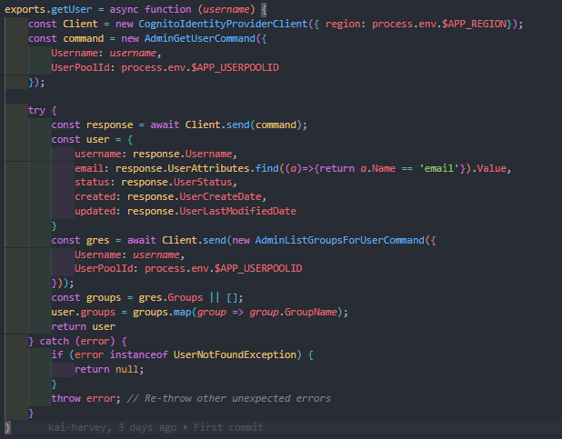
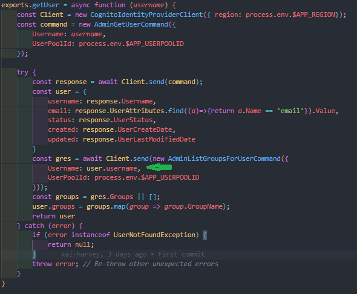
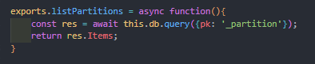
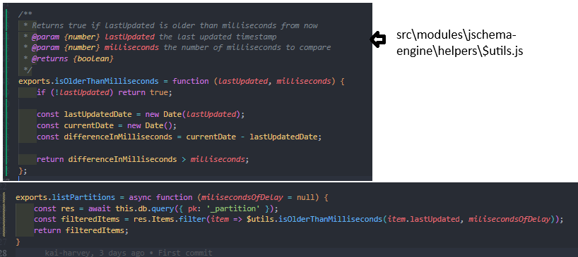
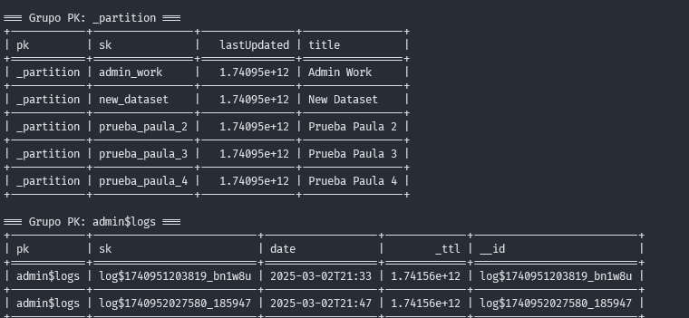

# Aproximación al Challenge - Keiner Alvarado  

## Pasos para resolver el desafío  

### 1. Configuración inicial  
Después de seguir las instrucciones de la sección **"Desafío para Desarrolladores"**, decidí ejecutar el proyecto de manera local para probar su funcionamiento y demostrar mis habilidades.  

Tras algunos intentos y ajustes, logré ejecutar correctamente el proyecto en mi entorno local. Durante este proceso, analicé la estructura del código y realicé algunas modificaciones en el backend para que la aplicación funcionara correctamente. Este análisis fue clave para abordar el desafío.  

### 2. Identificación y solución de un bug  
Durante las pruebas, encontré un bug en el archivo `src\modules\jschema-engine\helpers\$users.js`, el cual impedía la visualización de los datasets. La solución consistió en modificar una línea de código. A continuación, se muestran las imágenes del antes y después:  

**Antes:**  
  

**Después:**  
  

### 3. Filtrado de particiones  
Una vez solucionado el bug, pude avanzar en el desafío. Me aseguré de que, al obtener las particiones, estas se filtraran correctamente en el archivo `src\modules\jschema-engine\$engine.js`.  

**Antes:**  
  

**Después:**  
  

### 4. Actualización del campo `lastUpdated`  
Tras solucionar el problema con la lista de pruebas, el desafío quedó resuelto hasta donde logré comprender.  

En el proceso, consideré implementar una estructura de suscripciones a eventos, pero finalmente descarté esta idea. Sin embargo, asumí que al editar un dataset mediante la función `edit` en `src\modules\jschema-engine\helpers\$db.js`, también se debería actualizar el campo `lastUpdated`, lo cual sería lo ideal.  

Aquí se muestra una imagen de referencia del campo `lastUpdated` en los datasets:  

  

### 5. Mejoras de rendimiento  
Para optimizar el rendimiento, realicé mejoras en el archivo `src\modules\engine-hydrator.js`, específicamente en la función `formatDef`. Estas mejoras quedaron documentadas con comentarios en el código.  

### 6. Scripts y archivos Docker  
Durante las pruebas, desarrollé algunos scripts y Dockerfiles útiles para el desafío. Estos se encuentran en esta misma carpeta:  

- **Scripts:**  
  - `keiner-temp\congnito-client.py`: Cliente para el servicio Docker de Cognito.  
  - `keiner-temp\dynamodb-client.py`: Cliente para el servicio Docker de DynamoDB.  

- **Dockerfiles:**  
  - Ubicados en `keiner-temp\dockerfiles`.  